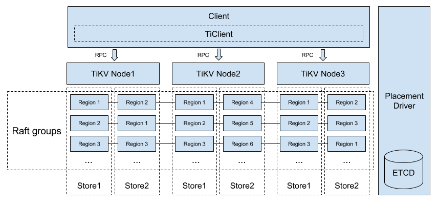

## TiKV is a distributed Key-Value database powered by Rust and Raft

  

TiKV (The pronunciation is: /'taɪkeɪvi:/ tai-K-V, etymology: titanium) is a distributed Key-Value database which is based on the design of Google Spanner and HBase, but it is much simpler without dependency on any distributed file system. With the implementation of the Raft consensus algorithm in Rust and consensus state stored in RocksDB, it guarantees data consistency. Placement Driver which is introduced to implement sharding enables automatic data migration. The transaction model is similar to Google's Percolator with some performance improvements. TiKV also provides snapshot isolation (SI), snapshot isolation with lock (SQL: select ... for update), and externally consistent reads and writes in distributed transactions. See [TiKV-server software stack](#tikv-server-software-stack) for more information. TiKV has the following primary features:

- __Geo-Replication__
TiKV uses Raft and Placement Driver to support Geo-Replication.

- __Horizontal scalability__
With Placement Driver and carefully designed Raft groups, TiKV excels in horizontal scalability and can easily scale to 100+ TBs of data.

- __Consistent distributed transactions__
Similar to Google's Spanner, TiKV supports externally-consistent distributed transactions.

- __Coprocessor support__
Similar to Hbase, TiKV implements the coprocessor framework to support distributed computing.

- __Working with [TiDB](https://github.com/pingcap/tidb)__
Thanks to the internal optimization, TiKV and TiDB can work together to be the best database system that specializes in horizontal scalability, support for externally-consistent transactions, as well as a focus on supporting both traditional RDBMS and NoSQL.

### Required Rust version

Rust Nightly is required.

### Tikv-server software stack
This figure represents tikv-server software stack.

- Placement driver: Placement Driver (PD) is the cluster manager of TiKV. PD periodically checks replication constraints to balance load and data automatically.
- Store: There is a RocksDB within each Store and it stores data into local disk.
- Region: Region is the basic unit of Key-Value data movement. Each Region is replicated to multiple Nodes. These multiple replicas form a Raft group.
- Node: A physical node in the cluster. Within each node, there are one or more Stores. Within each Store, there are many Regions.

When a node starts, the metadata of the Node, Store and Region are registered into PD. The status of each Region and Store is reported to PD regularly.

### Build

TiKV is a component in the TiDB project, you must build and run it with TiDB and PD together.

If you want to use TiDB in production, see [deployment build guide](https://github.com/pingcap/docs/blob/master/dev-guide/deployment.md) to build the TiDB project first.

If you want to dive into TiDB, see [development build guide](https://github.com/pingcap/docs/blob/master/dev-guide/development.md) on how to build the TiDB project.

### Next steps

+ Read the [deployment doc](https://github.com/pingcap/docs/blob/master/op-guide/binary-deployment.md#multi-nodes-deployment) on how to run the TiDB project.
+ Learn the [configuration explanations](https://github.com/pingcap/docs/blob/master/op-guide/configuration.md).
+ Use [Docker](https://github.com/pingcap/docs/blob/master/op-guide/docker.md) to run the TiDB project.

### Contributing

See [CONTRIBUTING](./CONTRIBUTING.md) for details on submitting patches and the contribution workflow.

### License

TiKV is under the Apache 2.0 license. See the [LICENSE](./LICENSE) file for details.

### Acknowledgments
- Thanks [etcd](https://github.com/coreos/etcd) for providing some great open source tools.
- Thanks [RocksDB](https://github.com/facebook/rocksdb) for their powerful storage engines.
- Thanks [mio](https://github.com/carllerche/mio) for providing metal IO library for Rust.
- Thanks [rust-clippy](https://github.com/Manishearth/rust-clippy). We do love the great project.
