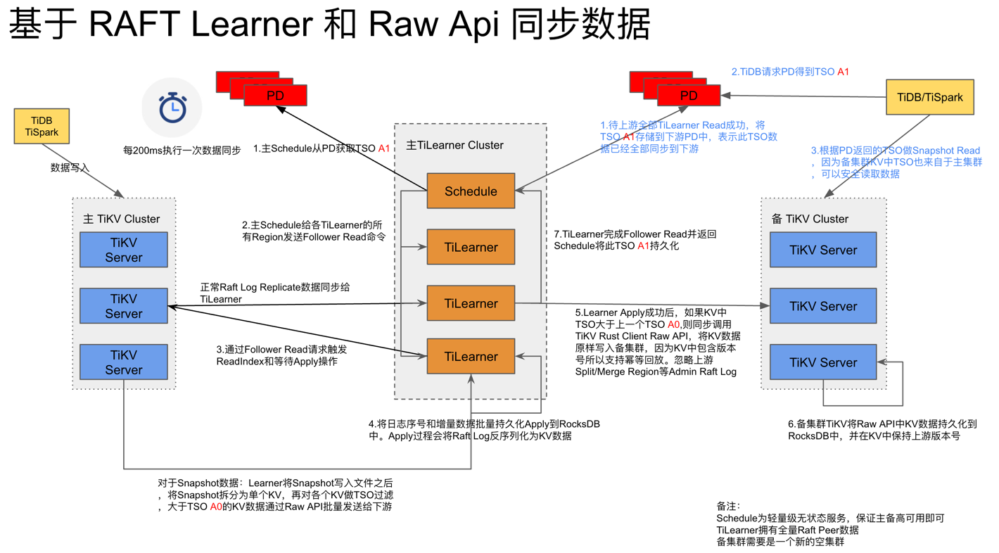

# TiMultiple：基于 Raft Learner 和 Raw API 实现多集群读写分离和在线灾备

### [团队介绍]
- [arthurm33](https://github.com/arthurm33): 开源软件爱好者，目前就职于建设银行，对 TiDB 和 TiCDC 有浓厚兴趣。
- [birdstorm](https://github.com/birdstorm): 资深数据库研发，开源软件爱好者， TiSpark & RawKV Committer
- [CalvinNeo](https://github.com/CalvinNeo): 开源软件爱好者，TiFlash 研发
- [lizhenhuan](https://github.com/lizhenhuan): 开源软件爱好者

### 战队宣言
希望速度比 TiCDC 快很多倍

### 背景
```
TiDB 是 PingCAP 公司自主设计、研发的开源分布式关系型数据库，同时支持在线事务处理与在线分析处理，供水平可扩展性、强一致性和高可用性，
兼容 MySQL 5.7 协议和 MySQL 生态，是当下非常热门的数据库产品。
目前部分银行开始尝试将 TiDB 应用到核心系统中，由于安全合规要求需要实现核心系统数据库跨机房多集群灾备，需要满足 RPO 15min, > RTO 30min 。由于核心系统数据库写入流量很大， TiCDC 无法支持超大量写入实时灾备，目前 TiCDC 架构中需要将 KV Change Log 转化为 SQL 并且需要在 Capture 做事务排序导致性能无法满足核心系统实时灾备要求。
TiMultiple 项目基于 Raft Learner 和 Raw KV API 实现存储到存储复制，不需要将 KV 数据转化为 SQL ，也不需要按照事务排序进而大幅度提升跨集群数据同步效率，并为 TiDB 提供多集群读写分离能力
```

### 目标
* 1.为 TiDB 提供多集群读写分离能力
* 2.为 TiDB 用户实现超大写入实时灾备能力
* 3.性能可扩展，在硬件充足时速度比 TiCDC 快 5 倍以上
* 4.确保数据正确性完全满足 ACID 特性

### 实施方案
* 1.通过 TiKV Label 和 Placement Rules in SQL 配置 TiLearner 实例
* 2.Schedule 向主集群 PD 获取TSO A1
* 3.Schedule 向主集群 Learner 发起 Follower Read
* 4.主集群 TiKV Apply 时同步的将KV数据调用 raw api 发送到备集群，并且过滤掉 KV 中 TSO 小于 A0 的数据
* 5.所有 Learner Follower Read 成功返回给 Schedule
* 6.Schedule 将 TSO A1 写入备集群 PD
* 7.备集群 TiDB 读取数据时先获取 TSO A1，再做 Snapshot Read
* 8.在 Raft Snapshot Read 时将接受到的数据存入 SST 文件成功后继续将数据拆分为 KV ，然后通过 Raw KV API 将数据发送到备集群


### [架构图](./images/ti_multiple.png)


