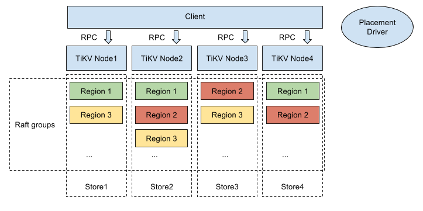

## TiKV is a distributed KV database powered by Rust.

TiKV is a Distributed Key-Value Database which mainly refers to the design of Google Spanner and HBase, but much simpler (Don't depend on any distributed file system). We've implemented the Raft consensus algorithm in Rust and stored consensus state in RocksDB. It not only guarantees consistency for data but also makes use of placement driver to implement sharding (split && merge) and data migration automatically. The transaction model is similar to Google's Percolator, and with some performance improvements. In fact, we provide snapshot isolation (SI) and serializable snapshot isolation (SSI), and then externally consistent reads and writes in distributed transactions. Some details can see [Tikv-server software stack](#Tikv-server-software-stack). And some primary features list as follow.

- __Geo-Replication__  
TiKV uses Raft to support Geo-Replication. We have ported [etcd's raft] (https://github.com/coreos/etcd/tree/master/raft) implementation to Rust. By using raft, Key-Value regions always stay consistent. Placement driver (or pb) is also important for Geo-Replication. Pd collects state information from heartbeats of all Raft groups' leaders regularly. According to load feedback and isolation judgment, pd can rebalance data automatically and smoothly. So Geo-Replication can be achieved, and makes TiKV always stable and balanced across regions. 

- __Horizontal scalability__  
By carefully designing Raft groups and placement driver, we enable horizontal scalability in TiKV. A region, similar to spanner’s directory, is the base unit of data movement in TiKV. A region is controlled by one Raft group and its size is limited to 64 MBs . To achieve horizontal scalability, a region can split into two regions when the data size exceeds the limit automatically. Placement driver keeps the metadata of all regions. To ensure horizontal scalability, we ensure the metadata of each region is only 100s of bytes. Together with other techniques, TiKV can easily scale up to hold 100s of TBs of data.

- __Consistent distributed transactions__  
Similar to Google's Spanner，TiKV supports externally-consistent distributed transactions. Placement driver plugs in a set of TS system, therefore timestamp oracle will be allocated in global. When TiKV client send transaction request to TiKV server，server will check relavant meta from the pd's etcd, and then TS generate two valid timestamps in two seperated handling phase implying start timestamps and commit timestamps. Before transaction ends, the start timestamp will be carrying on util the transaction is committed. Once transaction is committed, externally-consistent transactions succeed.

- __Coprocessor support__  
TiKV will be accessable and any application can develop on TiKV. We tend to provide a simple deployment solution soon after.

- __Working with [TiDB](https://github.com/pingcap/tidb)__  
TiKV implements a set horizontal scalable and externally-consistent  transactions-supported distributed Key-Value Database. And TiDB is focus on supporting both traditional RDBMS and NoSQL. TiDB prodive semantic translation in accessing Database. TiKV will be the best performance accessed database system thanks to internal optimization.

### Required rust version

This project requires rust nightly, otherwise project build will fail. We choose Rust instead of Go (with which we've developped TiDB ) to develop this project, because there are two critical facts: firstly, despite Go's excellent GC，it still introduces too much of latency time and instability; secondly, cgo's costs introduces another instable performance. Performance is our primary consideration, then development efficiency. So Rust comes to our sight. 

### Tikv-server software stack
This figure represents tikv-server software stack. 

- Placement driver: With tikv-server，Placement driver is the most important part which merges placement driver and zonemaster in google's Spanner. pd maintains metas of all regions via etcd. A Timestamp system plugs in pd, which provide time oracle in global.
- Node：A physical node in cluster. Node id must be unique in global.
- Store：A node has one or some stores. Generally a store involves one disk. Each store maps to different paths，and store id must be unique in global either. Multiple stores primarily support a plurality of disks in one node.
- Region：Region is a logical concept. Key-Value datas are grouped by region. Region is the smallest unit of data movement, that's  geographic-replication unit. Every region is supported by a raft group and region id must be unique in global. 
- Peer: Peer is a logical concept. It stands for a raft-worked participant in a raft group. A peer in raft-worked group maybe turn up three roles, which are candidate, leader and follower.

When node starts, the ids of node, store and region must be registered into pd as well as their metas. Leaders of raft groups regularly report region state to pd. Pd control split/merge between regions.

A store starts up a rocksdb. Store also record its meta and raft group information in local as well as pd has managed them all via etcd. 

### Contributing

See [CONTRIBUTING](./CONTRIBUTING.md) for details on submitting patches and the contribution workflow.

### License

TiKV is under the Apache 2.0 license. See the [LICENSE](./LICENSE) file for details.

### Acknowledgments
- Thanks [etcd](https://github.com/coreos/etcd) for providing some great open source tools.
- Thanks [RocksDB](https://github.com/facebook/rocksdb) for their powerful storage engines.
- Thanks [mio](https://github.com/carllerche/mio) for providing metal IO library for Rust.
- Thanks [rust-clippy](https://github.com/Manishearth/rust-clippy). We do love the great project. 
